= Übungsblatt 2 - Softwareentwicklung I
:icons: font
Prof. Dr. Ullrich Hafner <ullrich.hafner@hm.edu>
:toc-title: Inhaltsverzeichnis
:chapter-label:
:chapter-refsig: Kapitel
:section-label: Abschnitt
:section-refsig: Abschnitt

:xrefstyle: short
:sectnums:
:partnums:
ifndef::includedir[:imagesdir: ./]
ifndef::imagesdir[:imagesdir: ./]
ifndef::plantUMLDir[:plantUMLDir: .plantuml/]
:figure-caption: Abbildung
:table-caption: Tabelle

[TIP]
====

Die Abgabe dieses Übungsblattes ist möglich bis zum 12.11. 23:59. Laden Sie Ihre Lösungen im
https://classroom.github.com/a/GAw1VA7r[GitHub Classroom] Projekt auf den eigenen `master` Branch hoch.
Im Praktikum haben Sie gesehen, wie Sie dies am einfachsten umsetzen. Eine Verwendung von Pull Requests ist nicht
erforderlich. Wenn Sie Pull Requests nutzen, müssen alle Lösungen in einem Pull Request abgegeben werden, sonst
funktioniert das Autograding nicht.

====

[hinweise]
== Allgemeine Hinweise bzw. Tipps

[TIP]
====

Kara kann über den Rand laufen und schauen. Nutzen Sie diese Möglichkeiten, um Ihre Lösungen zu vereinfachen! Kara
landet in diesen Fällen immer an der jeweils gegenüberliegenden Seite.

Beachten Sie, dass ab sofort in allen Aufgaben beliebige Welten (gemäß der Aufgabenstellung) zulässig sind.
D.h. eine Aufgabe ist nur teilweise gelöst, wenn Ihr Programm nur für einige der abgebildeten Varianten funktioniert.
Ebenso ist die Aufgabe nur teilweise gelöst, wenn zusätzliche Welten aus dem Autograding (meine automatisierten Tests)
nicht funktionieren.

Zum einfachen Testen in Greenfoot können die Szenarien nun jeweils mehrere Welten enthalten. Beim Laden eines Szenarios
werden Sie gefragt, in welcher Welt Kara starten soll (siehe Abbildung <<Weltenauswahl>>).

.Weltenauswahl
[#Weltenauswahl]
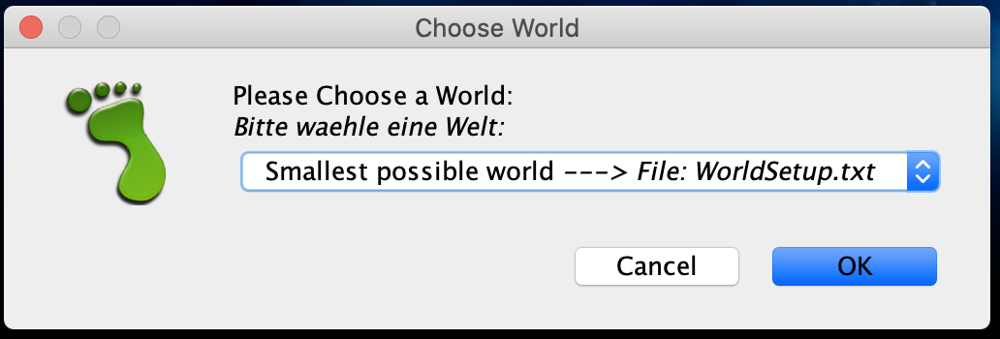

Wenn Sie anschließend zwischen verschiedenen Welten wechsel wollen, müssen Sie dazu folgende Schritte ausführen,
siehe Abbildung <<Weltenneuwahl>>.

. rechts auf den Kasten `KaraWorld` klicken
. links auf die Methode `void selectWorld()` klicken
. eine neue Welt auswählen

.Neustart mit anderer Welt
[#Weltenneuwahl]
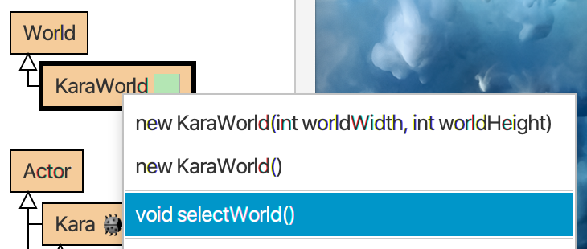

====

== Radieren und Schreiben

Im letzten Aufgabenblatt hatten Sie in Aufgabe 1 und 3 die Buchstaben HM in Karas Welt zu schreiben. Ändern Sie Ihre
Lösung zu dieser Aufgabe so ab, dass das Programm immer das geforderte HM Bild malt, egal wie vorher die Welt mit
Blättern gefüllt ist.

.Ausgangssituation 1 (links) und erwartetes Ergebnis (rechts)
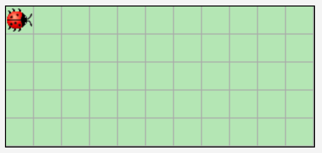

image:images/5-ziel.png[erwarteten Ergebnis, width=40%, pdfwidth=40%]

.Ausgangssituation 2 (links) und erwartetes Ergebnis (rechts)
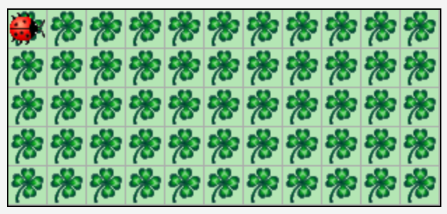

image:images/5-ziel.png[erwarteten Ergebnis, width=40%, pdfwidth=40%]

== Zebrastreifen

Schreiben Sie ein Programm, das Kara eine beliebig große leere Welt mit einem Zebrastreifen befüllt.
Die Welt kann eine beliebige Höhe _h_ ( _h_ ≥ 1) und eine gerade Breite 2 * _b_ ( _b_ ≥ 1) haben.
Denken Sie auch an die Höhe 1 und 2 und die Breite 2. Kara startet wieder links oben – dies soll auch die
Endposition sein.

.Ausgangssituation 1 (links) und erwartetes Ergebnis (rechts)
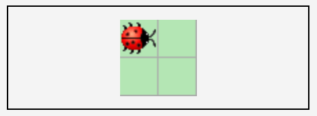

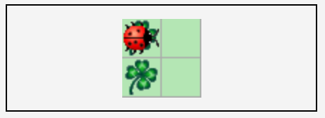

.Ausgangssituation 2 (links) und erwartetes Ergebnis (rechts)
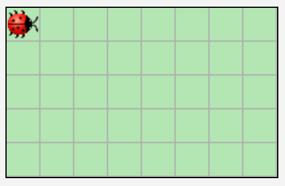

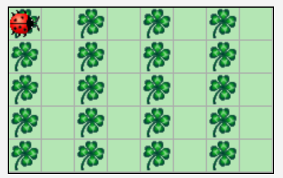

== Zäune

Kara will die Grenzen seiner Welt bepflanzen, d.h. einen Zaun aus Kleeblättern um die Welt ziehen. Schreiben Sie dazu
ein Programm, das Kara in einer leeren Welt mit beliebiger Größe (mindestens 2*2 Felder) auf allen Feldern am Rand ein
Kleeblatt ablegt. Kara startet wieder links oben – dies soll auch die Endposition sein.

.Ausgangssituation 1 (links) und erwartetes Ergebnis (rechts)
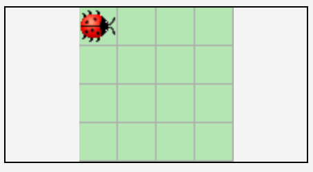

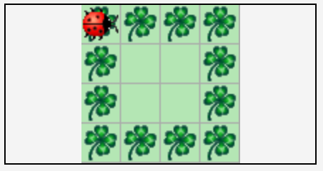

.Ausgangssituation 2 (links) und erwartetes Ergebnis (rechts)
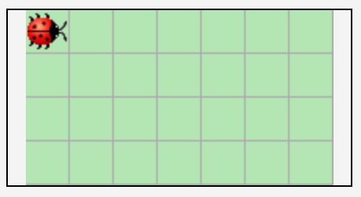

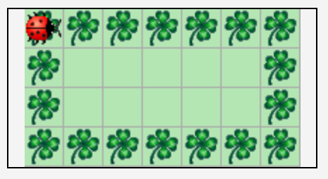

== Labyrinth

Schreiben Sie ein Programm, das Kara durch ein Labyrinth in einem Wald führt, bis es das einzige Kleeblatt gefunden hat.
Der Weg durch den Wald beginnt in der 1. Spalte links am Rand und endet rechts am Rand in der letzten Spalte.
Der Start und das Ende können sich dabei in einer beliebigen Zeile befinden, lediglich die erste und letzte Zeile sind
nicht möglich.

Das Labyrinth ist mindestens 3*3 groß und wie folgt aufgebaut:

- Das Labyrinth hat bis auf den Ein- und Ausgang einen durchgehenden Rand aus Bäumen.
- Die Spalten mit ungerader Nummer (erste, dritte, ...) sind bis auf einen einzelnen Durchgang komplett mit Bäumen gefüllt.
Der Durchgang ist beliebig positioniert, lediglich die erste und letzte Zeile sind nicht möglich.
- Die Spalten mit gerader Nummer (zweite, vierte, ...) sind bis auf den Rand oben und unten leer.
- Der Ausgang ist mit einem Kleeblatt markiert.

.Ausgangssituation 1 (links) und erwartetes Ergebnis (rechts)
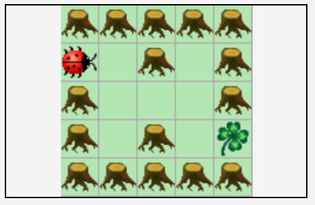

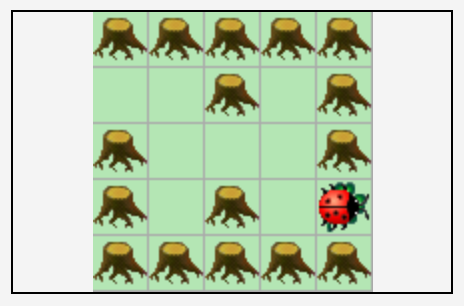

.Ausgangssituation 2 (links) und erwartetes Ergebnis (rechts)
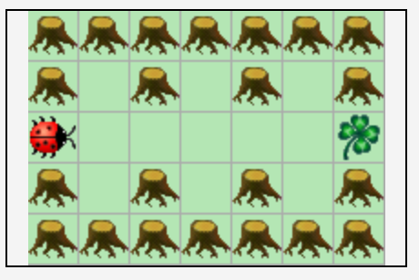

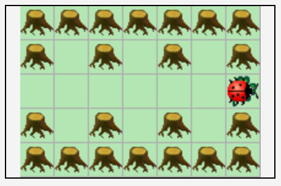

